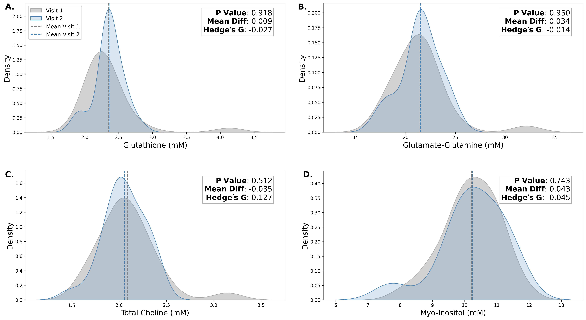
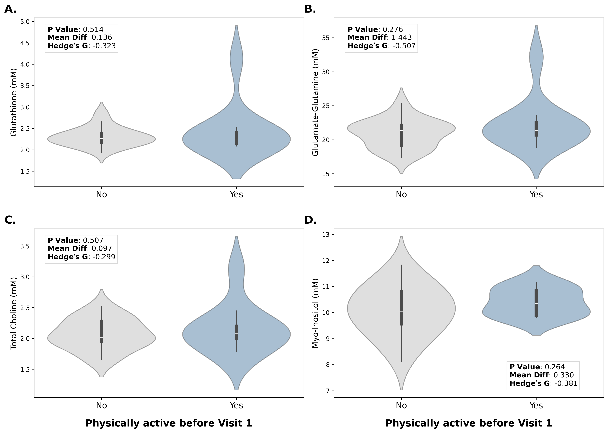
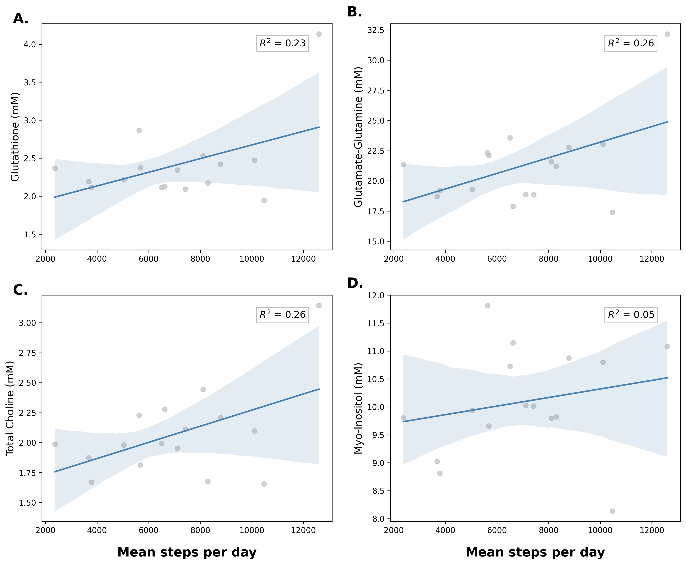
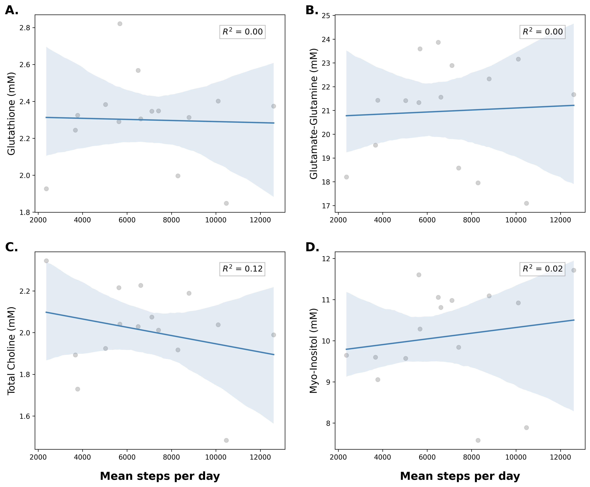

# Analysis of Magnetic Resonance Spectroscopy Data
Wingerson, MJ  
mat.wingerson@gmail.com

# Description 
Transparency of source code and results for a manuscript submitted to [journal tbd]. 

[Add citation when accepted]

---

# Overview

## Background:
Engagement in aerobic exercise is the current standard of care treatment for concussion; patients who exercise at higher volumes post-injury have symptoms resolve quicker. However, unknown are the underlying pathophysiological mechanisms which are altered during post-concussion exercise that subsequently contribute to symptom resolution.  

**Magnetic resonance spectroscopy (MRS)** is a neuroimaging approach that measures concentrations of various neurometabolites (chemicals) in the brain. For example, Myo-Inositol is often used as a marker of glial cell activity, increasing in concentrations when oxidative stress is present or neurons are damaged. Choline is essential for cell membrane support and is a precursor for neurotransmitter synthesis. Glutamate-Glutamine are excitatory neurotransmitters involved in executive functioning tasks and also serves as an important energy source for neurons when recovering from injury. And Glutathione is an anti-oxidant that responds to oxidative stress in damaged cells. In measuring these neurometabolites, researchers can gain insight into the chemical changes occurring post-injury and can more objectively quantify physiological responses to rehabilitation.  

The relationships between these neurometabolites and post-concussion exercise behaviors may better inform the underlying mechanisms by which exercise contributes to concussion recovery.  

## Objective:
Our **primary objective** was to compare neurometabolite concentrations of Myo-Inositol, Choline, Glutamate-Glutamine, and Glutathione at two timepoints in concussion recovery: initially within 21-days of injury when patients are still symptomatic, and again within 5-days of physician clearance to return-to-sport (i.e., no longer symptomatic).  

Our **secondary objective** was to investigate how exercise behaviors at various points in recovery are associated with these four neurometabolites. 

---

# Methods

## Primary objective

### Variables
Neurometabolite concentrations of Myo-Inositol, Choline, Glutamate-Glutamine, and Glutathione at two timepoints in concussion recovery: initially within 21-days of injury when patients are still symptomatic, and again within 5-days of physician clearance to return-to-sport (i.e., no longer symptomatic).  

### Analysis
Paired-samples t-test & Kernel Density Estimate plots

### Results
  

No significant differences between neurometabolites Myo-Inositol, Choline, Glutamate-Glutamine, and Glutathione between Visit 1 and Visit 2 post-injury. 

---

## Secondary objective (a)

### Variables 
**Outcome:** Neurometabolite concentrations of Myo-Inositol, Choline, Glutamate-Glutamine, and Glutathione at Visit 1  

**Predictor:** Participant self-reported engagement in physical activity in the time between injury and Visit 1 (binary, yes vs no).  

**Covariate:** Time to visit 1. This was selected as a covariate based on past research which found that neurometabolite exist in different concentrations across time after injury. 

### Analysis 
Independent Samples t-tests and Violin Plots

### Results
  

No significant differences in neurometabolites Myo-Inositol, Choline, Glutamate-Glutamine, and Glutathione between participants who did and did not report engaging in physical activity prior to Visit 1. 

---

## Secondary objective (b)

### Variables 
**Outcome:** Actigraphy-measured steps per day taken by participants during a 2-week activity monitoring period after Visit 1.  

**Predictor:** Neurometabolite concentrations of Myo-Inositol, Choline, Glutamate-Glutamine, and Glutathione at Visit 1.  

**Covariate:** Symptom severity at Visit 1. This was selected as a covariate based on past research which found that post-concussion exercise behaviors differ based on current symptom severity.  

### Analysis 
Linear regression: steps/day = $beta$*NeurometaboliteVisit1 + $beta$*SymptomSeverity + intercept

### Results
  

Neurometabolites Choline, Glutamate-Glutamine, and Glutathione, but not Myo-Inositol, at Visit 1 were associated with the average steps/day participants took in the subsequent 2-weeks. For every 1mM increase in Glutathione Glutamate-Glutamine, and Choline, participants took an average of 2531 (95% CI: -276, 5339; p=0.073), 407 (95% CI: -6, 821; p=0.053), and 3954 (95% CI: -38, 7946; p=0.052) more steps/day, respectively. 

---

## Secondary objective (c)

### Variables 
**Outcome:** Neurometabolite concentrations of Myo-Inositol, Choline, Glutamate-Glutamine, and Glutathione at Visit 2.  

**Predictor:** Actigraphy-measured steps per day taken by participants during a 2-week activity monitoring period after Visit 1.  

**Covariate:** Time to Visit 2. Neurometabolite exist in different concentrations across time after injury.  

### Analysis 
Linear regression: NeurometaboliteVisit2 = $beta$*StepsPerDay + $beta$*TimeToVisit2 + intercept

### Results
  

The number of steps/day participants took during the 2-week monitoring period was not associated with concentrations of neurometabolites Choline, Glutamate-Glutamine, Glutathione, or Myo-Inositol at Visit 2.  

---

# Key take-aways

1. Concentrations of neurometabolites Choline, Glutamate-Glutamine, Glutathione, and Myo-Inositol did not significantly change between assessments within 21-days of injury and at the time of clearance to return-to-play.

2. Though physical activity is the standard of care treatment for concusion symptoms, participants who reported being physically active prior to Visit 1 did not have altered neurometabolite concentrations compared to those who did not report being physically active.

3. The ammount of physical activity participants performed during recovery was not associated with neurometabolite concentrations at Visit 2, around the time that participants were returning to sports.

4. However, concentrations of metabolites Choline, Glutamate-Glutamine, and Glutathione at Visit 1, were associated with the volume of physical activity that participants would perform in the subsequent 2-weeks, even after controlling for symptom severity.

**In this observational study of adolescents post-concussion, neurometabolites Choline, Glutamate-Glutamine, Glutathione, and Myo-Inositol did not respond to variations in physical activity levels. However, early neurometabolite concentrations were associated with subsequent physical activity engagement during recovery.**  

These findings suggest that neurometabolic status shortly after concussion may influence an individual's natural recovery trajectory and propensity to resume activity, independent of symptom severity. This could have implications for understanding individual variability in exercise tolerance during concussion rehabilitation and tailoring of activity recommendations.
